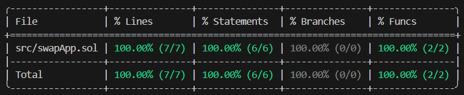

# Swap App
## Overview 🪙
An app for swapping tokens, in this case USDC -> WBTC. Forking the Arbitrum network.
## Features 📃
* Swap your USDC for WBTC
## Technical details ⚙️
* Interface for swapping tokens -> Uniswap v2 Contract Deployments.
* V2Router02 Contract Address -> 0x4752ba5dbc23f44d87826276bf6fd6b1c372ad24 (Arbitrum).
* Forked network for testing -> Arbitrum.
* RPC Server Address -> https://arb1.arbitrum.io/rpc.
* Framework CLI -> Foundry.
* Forge version -> 1.1.0-stable.
* Solidity compiler version -> 0.8.24.
## Deploying the contract 🛠️
1. Clone the GitHub repository.
2. Open Visual Studio Code (you should already have Foundry installed).
3. Select "File" > "Open Folder", select the cloned repository folder.
4. In the project navigation bar, open the "swapApp.t.sol" file located in the "test" folder.
5. On line 18 ("Address with USDC in Arbitrum Mainnet") enter the address of your wallet with USDC in the Arbitrum network. Note: Verify that you have at least 5 USDC on the Arbitrum network.
6. In the toolbar above, select "Terminal" > "New Terminal".
7. Select the "Git bash" terminal (previously installed).
8. Run the command `forge test -vvvv --fork-url https://arb1.arbitrum.io/rpc --match-test` followed by the name of a test function to test it and verify the smart contract functions are working correctly. For example, run `forge test -vvvv --fork-url https://arb1.arbitrum.io/rpc --match-test testHasBeenDeployedCorrectly` to test the `testHasBeenDeployedCorrectly` function.
9. Run `forge test -vvvv --fork-url https://arb1.arbitrum.io/rpc --match-test testSwapTokensCorrectly` to swap your 5 USDC for WBTC. This is just a test on the forked Arbitrum network, so your USDC will remain in your wallet after this.
10. If you want to change the amount of USDC to swap, you will have to edit the `amountIn` variable in the `testSwapTokensCorrectly()` function.
11. Run `forge coverage --fork-url https://arb1.arbitrum.io/rpc` to generate a code coverage report, which allows you to verify which parts of the "swapApp.sol" script code (in the "src" folder) are executed by the tests. This helps identify areas outside the coverage that could be exposed to errors/vulnerabilities.
## Functions 📌
* `swapTokens()` -> Swap USDC for WBTC.
## Testing functions ⌨️
* `testHasBeenDeployedCorrectly()` -> Verify that the swap app has been correctly initialized with the correct router address (`uniswapV2SwapRouterAddress`).
* `testSwapTokensCorrectly()` -> Verify that the 5 USDC to WBTC swap was successful. Note: The amount of WBTC you receive will vary depending on the liquidity in the USDC -> WBTC liquidity pool.
## Forge Coverage ✅
  

CODE IS LAW!
